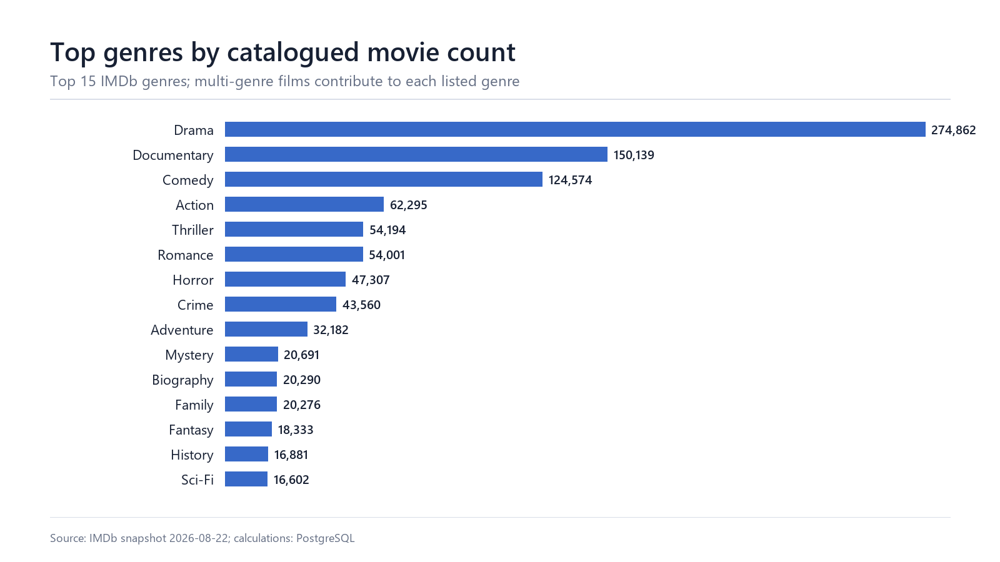
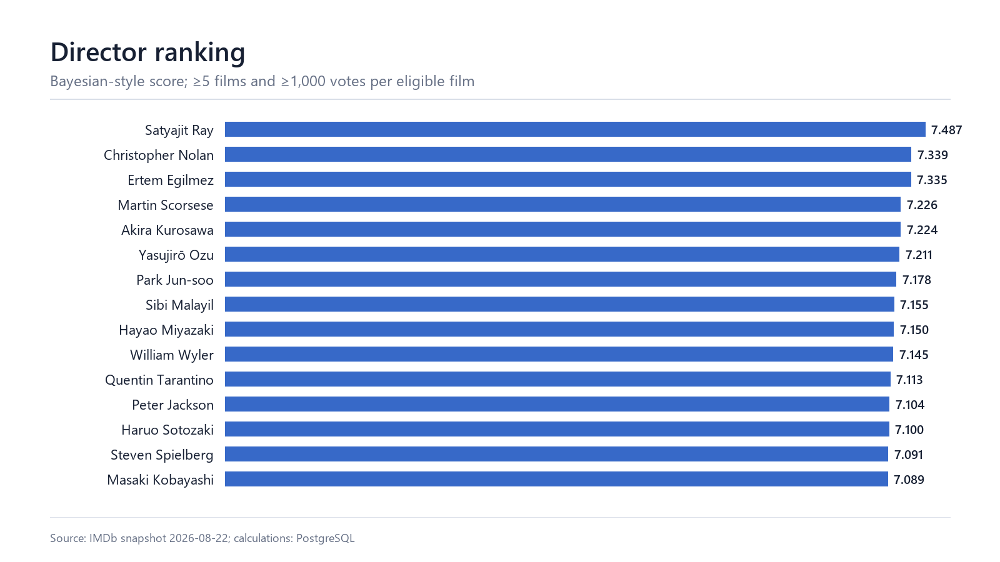
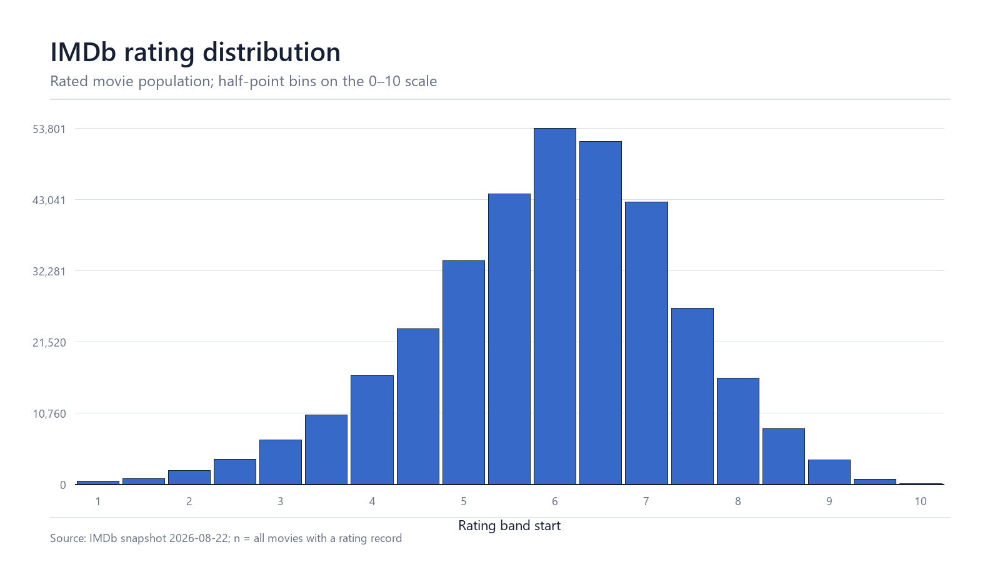
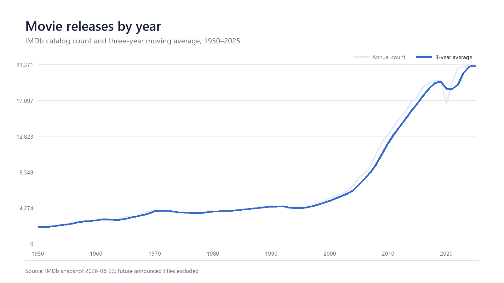
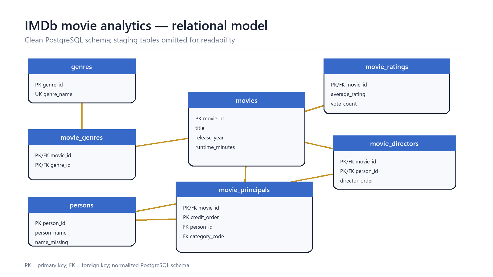

# IMDb Movie Analytics

PostgreSQL project based on the official
[IMDb Non-Commercial Datasets](https://developer.imdb.com/non-commercial-datasets/).

The project builds a normalized PostgreSQL database and analyzes movie ratings,
genres, directors, actors, collaborations, and release trends.

The goal is to demonstrate a complete analytics workflow: preparing raw data,
designing a relational model, checking data quality, answering business
questions, optimizing queries, and presenting reproducible findings.

## Project overview

| Item | Value |
|---|---:|
| IMDb snapshot | 2026-08-22 |
| Movies | 745,764 |
| Movies with ratings | 344,865 |
| Movies with at least 1,000 votes | 48,936 |
| Principal credits | 8,598,067 |
| SQL analysis queries | 37 |
| Database | PostgreSQL 17 |

## Business questions

- Which genres are the largest and highest rated?
- Which directors and actors combine quality with a reliable sample size?
- Which actor pairs collaborate most frequently?
- How have movie volume and genre shares changed over time?
- Which films are highly rated relative to the attention they receive?

## Dataset

The project uses five compressed IMDb files:

- `title.basics.tsv.gz` — titles, years, runtime, and genres;
- `title.ratings.tsv.gz` — ratings and vote counts;
- `title.crew.tsv.gz` — directors;
- `title.principals.tsv.gz` — principal cast and crew;
- `name.basics.tsv.gz` — person names.

The analytical population includes records where `titleType = 'movie'` and
`isAdult = 0`. Ranking queries use explicit vote thresholds to reduce
small-sample noise. Raw and processed datasets are excluded from Git.

## Key findings

- Drama is the largest genre with 274,862 movies.
- Documentary has the highest average rating among substantial genres: 7.19
  across 2,560 movies with at least 1,000 votes.
- *The Shawshank Redemption* ranks first using a score that combines rating and
  vote percentiles.
- Rating and rating activity have only a weak positive relationship
  (`r = 0.204` after log-transforming vote count).
- IMDb catalogued 18.13% more movies in 2016–2020 than in 2011–2015.

The queries behind these results are available in
[`sql/12_portfolio_findings.sql`](sql/12_portfolio_findings.sql).

## Visualizations

| Genre distribution | Director ranking |
|:---:|:---:|
|  |  |
| **Rating distribution** | **Movie release trend** |
|  |  |

## Data pipeline

```text
IMDb .tsv.gz files
        ↓
Python streaming and movie filtering
        ↓
PostgreSQL staging tables
        ↓
Normalized analytical tables
        ↓
Quality checks, views, and indexes
        ↓
SQL findings and generated charts
```

The Python preparation step reads the compressed source files as streams, so
the full IMDb files do not need to be unpacked on disk.

## Database model

The schema separates movies, ratings, genres, people, directors, and principal
credits. Many-to-many relationships are stored in bridge tables.



## SQL skills demonstrated

- joins, aggregations, subqueries, and CTEs;
- `CASE`, conditional aggregation, and NULL handling;
- `ROW_NUMBER`, `RANK`, `DENSE_RANK`, `LAG`, and `LEAD`;
- moving averages, percentiles, correlation, and statistical summaries;
- self joins for actor collaborations;
- data-quality checks and referential-integrity validation;
- indexes and `EXPLAIN (ANALYZE, BUFFERS)`;
- normalized relational database design.

The repository contains 5 easy, 8 medium, and 24 advanced analytical queries.

## Analysis guide

| SQL file | Purpose |
|---|---|
| [`02_data_quality.sql`](sql/02_data_quality.sql) | Missing values, duplicates, coverage, and integrity checks |
| [`03_eda.sql`](sql/03_eda.sql) | Dataset distributions and analytical populations |
| [`05_genre_analysis.sql`](sql/05_genre_analysis.sql) | Genre size, ratings, rankings, and annual share |
| [`06_director_analysis.sql`](sql/06_director_analysis.sql) | Director performance, consistency, and career trends |
| [`07_actor_analysis.sql`](sql/07_actor_analysis.sql) | Actor rankings and collaboration self joins |
| [`08_trend_analysis.sql`](sql/08_trend_analysis.sql) | Release trends, moving averages, and year-over-year change |
| [`09_advanced_analysis.sql`](sql/09_advanced_analysis.sql) | Percentiles, scoring, similarity, and correlation |

Targeted indexing reduced the local top-rated-movies query from approximately
39.5 ms to 0.32 ms in `EXPLAIN ANALYZE`. Exact timings depend on hardware and
cache state. The comparison is reproducible with
[`11_performance_comparison.sql`](sql/11_performance_comparison.sql).

## Tools

- PostgreSQL 17
- SQL
- Python
- Docker Compose
- PowerShell
- Git

## Run locally

Requirements: Docker Desktop, Python 3.11+, and the five IMDb source files in
`data/raw/imdb/`.

```powershell
.\scripts\run_all.ps1
```

Validate the finished database:

```powershell
.\scripts\validate_project.ps1
```

Regenerate the charts after the SQL exports:

```powershell
pip install -r requirements-visuals.txt
python .\scripts\render_charts.py
```

The first run may take tens of minutes because the project loads and indexes
more than eight million principal-credit rows.

## Repository guide

```text
sql/       database schema, loading, analysis, views, indexes, validation
scripts/   data preparation, project runner, chart generation
images/    portfolio-ready charts and ER diagram
data/      ignored IMDb source and processed files
```

## Data limitations

- IMDb ratings and vote counts change over time.
- Vote count measures rating activity, not verified audience size.
- Principal credits are not complete cast lists.
- The dataset does not contain budget or revenue.
- Correlation does not establish causality.

IMDb data is used for personal and non-commercial purposes and is not
redistributed in this repository. See [`NOTICE.md`](NOTICE.md).
